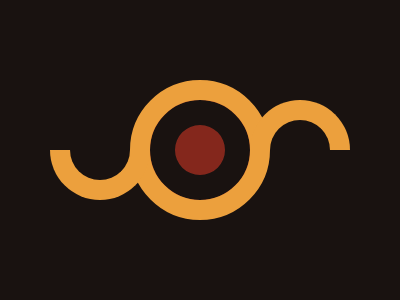

# Battle n.1 - Target n.11 - Eye of Sauron



[Here's the challenge](https://cssbattle.dev/play/11)

Hey, that is how to draw a semicircle! I banged my head for a while, but lesson learned!

```html
<div class="circle left"></div>
<div class="eye"></div>
<div class="circle right"></div>
<style>
  body {
    margin: 0;
    height: 100%;
    background: #191210;
    display: flex;
    justify-content: center;
    align-items: center;
  }
  .circle {
    position: absolute;
    width: 60px;
    aspect-ratio: 2 / 1;
    background: #191210;
    border: 20px solid #ECA03D;
    border-radius: 0 0 50px 50px;
    border-top: transparent;
  }
  .circle.left {
    top: 150px;
    left: 50px;
  }
  .circle.right {
    top: 100px;
    right: 50px;
    rotate: 180deg;
  }
  .eye {
    width: 100px;
    aspect-ratio: 1;
    background: #191210;
    border: 20px solid #ECA03D;
    border-radius: 50%;
    display: flex;
    justify-content: center;
    align-items: center;
  }
  .eye::after {
    content: "";
    width: 50px;
    aspect-ratio: 1;
    background: #84271C;
    border-radius: 50%;
  }
</style>
```
