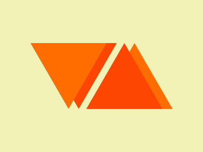

# Battle n.2 - Target n.14 - Web Maker Logo



[Here's the challenge](https://cssbattle.dev/play/14)

This was funny! Staking context, CSS variables, polygons and transformations!

```html
<div class="container with-shadow downward-colors"><div class="triangle"></div></div>
<div class="container with-shadow upward-colors"><div class="triangle upside-down"></div></div>
<style>
  body {
    height: 100%;
    margin: 0;
    background: #F2F2B6;
  }
  .container {
    position: absolute;
    width: 100%;
    height: 100%;
  }
  .downward-colors {
    --shadow-color: #FD4602;
    --triangle-color: #FF6D00;
  }
  .upward-colors {
    --shadow-color: #FF6D00;
    --triangle-color: #FD4602;
  }
  .with-shadow {
    filter: drop-shadow(20px 0 var(--shadow-color, green))
  }
  .triangle {
    height: 100%;
    clip-path: polygon(60px 85px, 210px 85px, 135px 215px);
    background: var(--triangle-color, blue);
  }
  .upside-down {
    transform: rotateX(180deg) translate(110px)
  }
</style>
```

Here is some bits of explaination.

This is the usual CSS reset. I guess I need to take some advantage from it.

```css
body {
    height: 100%;
    margin: 0;
}
```

Each triangle lives in its container with a different stacking context, so that I can put one next to the other with overlapping width.

```css
.container {
    position: absolute;
    width: 100%;
    height: 100%;
  }
```

Colors are defined in dedicated CSS classes. The classes must be in the same element, but inside that order does not matter.
`with-shadow` can be placed either before or after `downward-colors`, nothing changes as classes are applied together.

```css
<div class="container with-shadow downward-colors"></div>
```
