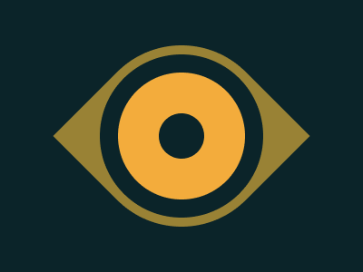

# Battle n.2 - Target n.16 - Eye of the Tiger



[Here's the challenge](https://cssbattle.dev/play/16)

Had fun with it.

```html
<div class="flex circle shape">
  <div class="flex circle sclera">
    <div class="flex circle iris">
      <div class="circle pupil"></div>
    </div>
  </div>
</div>
<style>
  body {
    margin: 0;
    height: 100%;
    background: #0B2429;
    display: flex;
    justify-content: center;
    align-items: center;
  }
  .flex {
    display: flex;
    justify-content: center;
    align-items: center;
  }
  .circle {
    width: var(--circle-w);
    aspect-ratio: 1;
    border-radius: 50%;
  }
  .shape {
    --circle-w: 200px;
    background: #998235;
    rotate: 45deg;
    border-radius: 50% 0;
  }
  .sclera {
    --circle-w: 180px;
    background: #0B2429;
  }
  .iris {
    --circle-w: 140px;
    background: #F3AC3C;
  }
  .pupil {
    --circle-w: 50px;
    background: #0B2429;
  }
</style>
```
