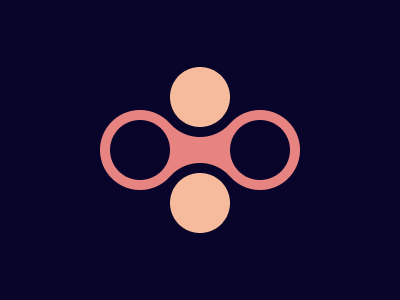

# Battle n.2 - Target n.17 - Figets Spinner



[Here's the challenge](https://cssbattle.dev/play/17)

This was challenging. This solution comes from the web as I was constantly failing the middle connection. 
Darn! The solution was so obvious!

```html
<div class="top"></div>
<div class="middleLeft"></div>
<div class="middle"></div>
<div class="middleRight"></div>
<div class="bottom"></div>
<style>
  body {
    margin: 0;
    height: 100%;
    background: #09042A;
    display: grid;
    justify-content: center;
    align-content: center;
  }
  div {
    width: 60px;
    height: 60px;
    border-radius: 50%;
  }
  .top, .bottom {
    grid-column-start: 2;
    background: #F5BB9C;
    box-shadow: 0px 0px 0px 10px #09042A;
    transform: translateY(7px);
  }
  .middleLeft, .middle, .middleRight {
    grid-row-start: 2;
  }
  .bottom {
    transform: translateY(-7px);
  }
  .middleLeft, .middleRight {
    box-shadow: 0px 0px 0px 10px #E78481;
    background: #09042A;
  }
  .middle {
    background: #E78481;
    transform: scale(1.4);
    z-index: -1;
  }
</style>
```
