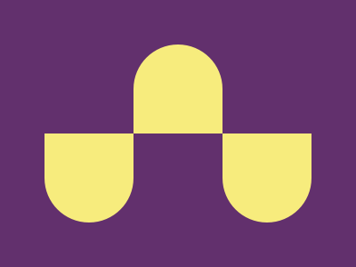

# Battle n.1 - Target n.4 - Ups n Downs



[Here's the challenge](https://cssbattle.dev/play/4)

Just a grid with a bit of fun on borders.

```html
<div class="grid">
  <div></div>
  <div class="bend up"></div>
  <div></div>
  <div class="bend"></div>
  <div></div>
  <div class="bend"></div>
</div>
<style>
  body {
    margin: 0;
    height: 100%;
    background: #62306D;
    display: flex;
    justify-content: center;
    align-items: center;
  }
  .grid {
    display: grid;
    grid-template: repeat(2, 100px) / repeat(3, 100px)
  }
  .grid > .bend {
    background: #F7EC7D;
    border-radius: 0 0 50% 50%;
  }
  .up {
    rotate:180deg;
  }
</style>
```
