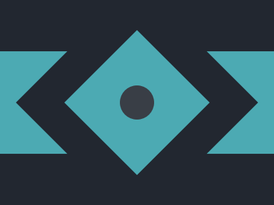

# Battle n.1 - Target n.9 - Tesseract



[Here's the challenge](https://cssbattle.dev/play/9)

Stacking context again.

```html
<div class="band"></div>
<div class="square big black"></div>
<div class="square small cyan"></div>
<div class="circle"></div>
<style>
  body {
    margin: 0;
    height: 100%;
    background: #222730;
    display: flex;
    justify-content: center;
    align-items: center;
  }
  .band {
    position: absolute;
    width: 100%;
    height: 150px;
    background: #4CAAB3;
  }
  .square {
    position: absolute;
    rotate: 45deg;
    aspect-ratio: 1;
  }
  .square.big {
    width: 250px;
  }
  .square.small {
    width: 150px;
  }
  .black {
    background: #222730;
  }
  .cyan {
    background: #4CAAB3;
  }
  .circle {
    position: absolute;
    width: 50px;
    aspect-ratio: 1;
    border-radius: 50%;
    background: #393E46;
  }
</style>
```
