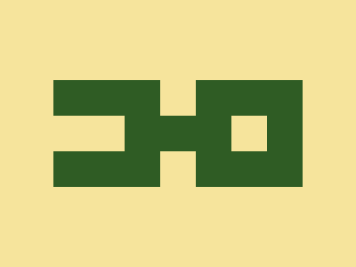

# 2023-10-19 Daily target

[Here's the challenge](https://cssbattle.dev/play/RajWqlqsnLREqAnipF9a)



This time I just used a grid, something that I would really do in real life.

```html
<div class="grid">
    <div class="rect"></div>
    <div class="rect"></div>
    <div class="rect"></div>
    <div></div>
    <div class="rect"></div>
    <div class="rect"></div>
    <div class="rect"></div>
    <div></div>
    <div></div>
    <div class="rect"></div>
    <div class="rect"></div>
    <div class="rect"></div>
    <div></div>
    <div class="rect"></div>
    <div class="rect"></div>
    <div class="rect"></div>
    <div class="rect"></div>
    <div></div>
    <div class="rect"></div>
    <div class="rect"></div>
    <div class="rect"></div>
</div>
<style>
    body {
        background: #F6E49C;
        display: grid;
        place-items: center;
        height: 100%;
        margin: 0;
    }
    
    .grid {
        display: grid;
        grid-template: repeat(3, 40px) / repeat(7, 40px);
    }
    
    .rect {
        background: #2F5C24;
    }
</style>
```
