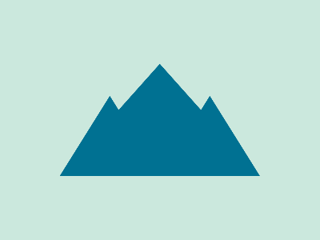

# 2023-10-27 Daily target

[Here's the challenge](https://cssbattle.dev/play/ufiyLFHqECtVCCbRWyZd)



Oh, I am in love with `clip-path`.

```html
<div class="peak side"></div>
<div class="peak mid"></div>
<div class="peak side opposite"></div>
<style>
  body {
    margin: 0;
    height: 100%;
    background: #CBE8DD;
    display: flex;
    align-items: center;
    justify-content: center;
  }
  .peak {
    background: #007192;
    position: absolute;
    width: 250px;
    height: 140px;
  }
  .mid {
    clip-path: polygon(0 100%, 50% 0, 100% 100%);
  }
  .side {
    clip-path: polygon(0 100%, 25% 40px, 50% 100%);
  }
  .opposite {
    transform: translateX(50%)
  }
</style>
```
